# 🛒 Blinkit Clone - User App (Android)

This is a **Blinkit-like grocery delivery app** built for Android users using **Firebase Realtime Database** and **Razorpay** for payments.
The app provides users with a smooth grocery shopping experience, featuring product browsing, categorization, search, 
ordering, and real-time status updates with push notifications.

---

## 📱 Features

✅ Display all products  
✅ View products **category-wise**  
✅ Search for products using keywords  
✅ Add products to cart and **place orders**  
✅ **Razorpay** integration for secure payments  
✅ View your ordered products  
✅ Get **push notifications** after placing an order  
✅ Track the **status** of your orders in real-time

---

## 🔧 Tech Stack

- **Android (Kotlin/XML)**
- **Firebase Realtime Database**
- **Firebase Cloud Messaging (FCM)** – for push notifications
- **Razorpay** – for payment gateway integration
- **MVVM Architecture**
- **LiveData**, **ViewModel**
- **Glide** – for image loading

---

## 📸 Screenshots


### 🖼️ Screenshots

| 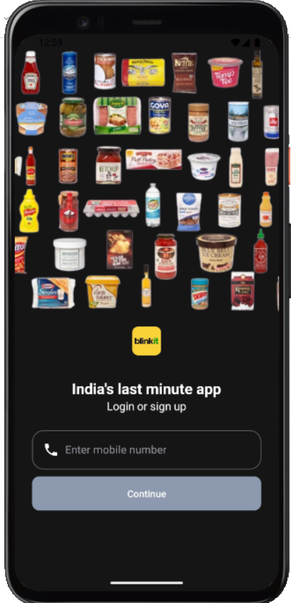 |  | 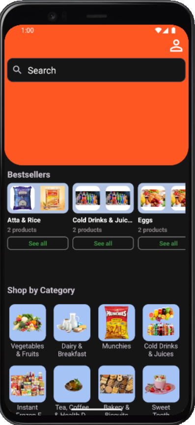 |  |
|---|---|---|---|
| 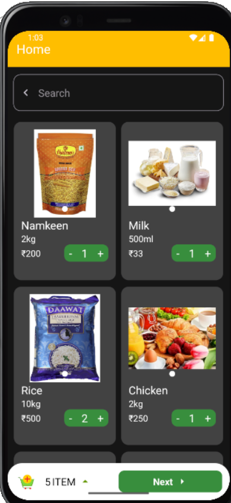 | 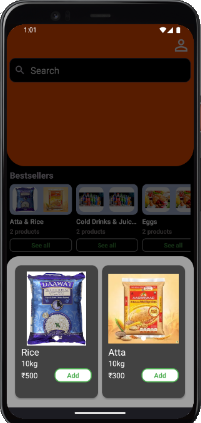 | 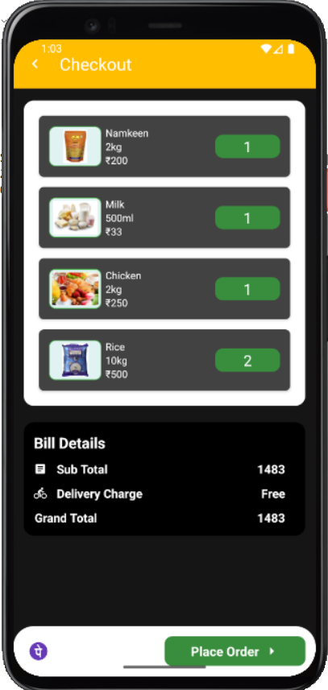 | 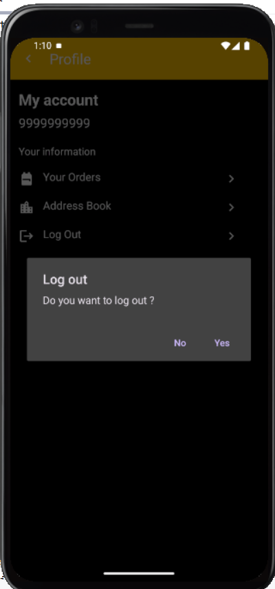 |
| 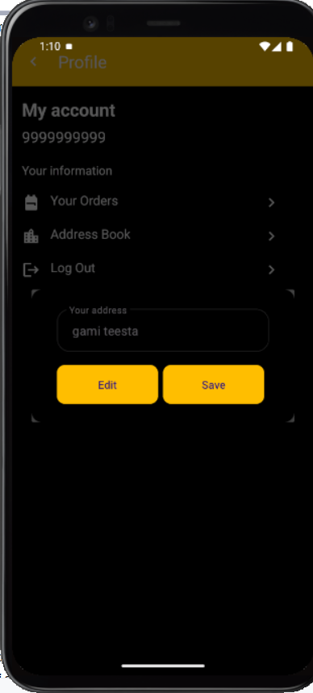 | 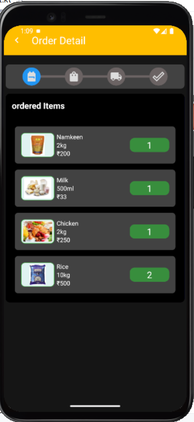 |  | 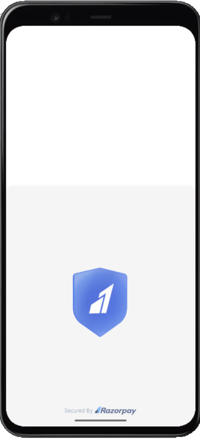 |
| 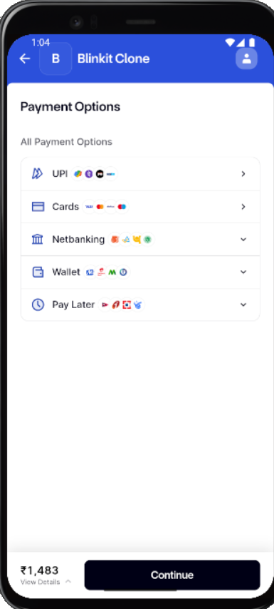 | 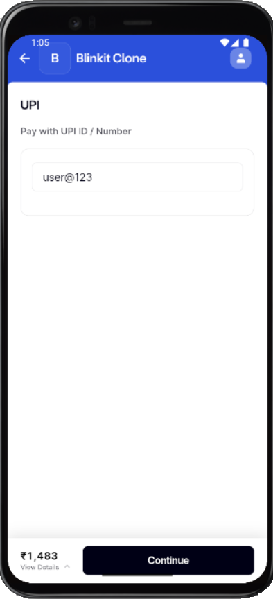 | 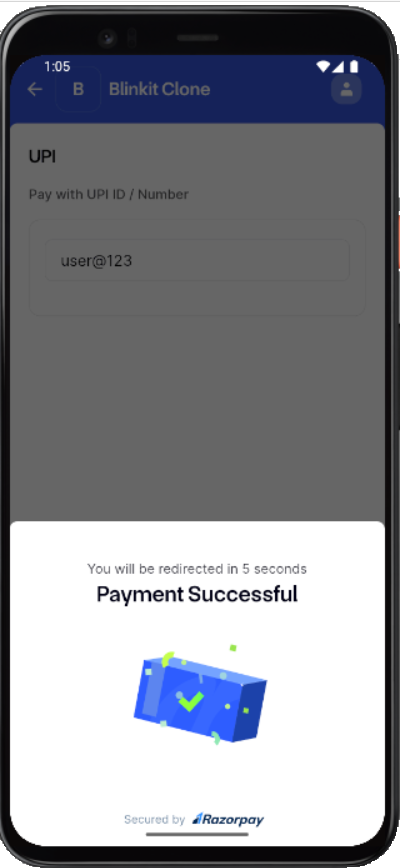 | 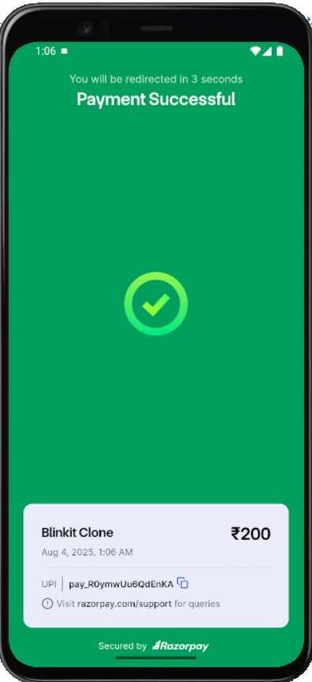 |
| 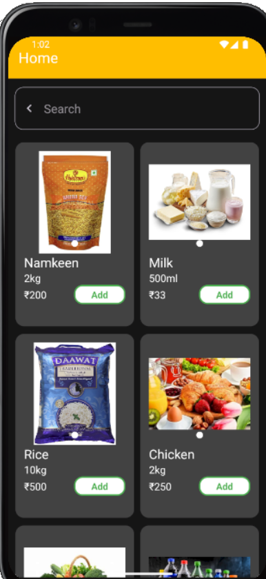 | 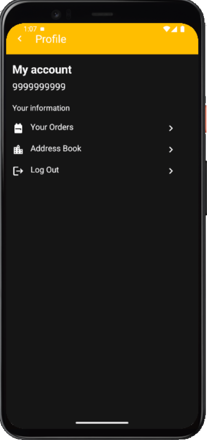 |  |  |


---

## 🚀 Getting Started

### Prerequisites

- Android Studio installed
- Firebase project configured
- Razorpay account & API keys

### Setup

1. Clone this repository:
   ```bash
   git clone https://github.com/PremmChand/BlinkitClone-User.git

How to Set Up Firebase Cloud Functions
Follow these steps to enable and use Firebase Cloud Functions for backend automation like sending notifications when an order is placed.

🔧 Prerequisites
Node.js installed

Firebase CLI installed (npm install -g firebase-tools)

A Firebase project already set up

📌 Steps
1. Login to Firebase using CLI
firebase login
2. Initialize Firebase in your project root
firebase init functions
3. Choose: Functions (use arrow keys to select)
->Select your Firebase project
->Choose JavaScript when asked for the language
->Choose whether to use ESLint (optional)
->Confirm to install dependencies
4. Navigate to the functions folder
cd functions
5. Write your Cloud Function logic
Open functions/index.js
Add your custom logic (e.g., send notification on order creation)

6. Install required packages (if not already)
npm install firebase-admin firebase-functions
Go back to root folder and deploy your function
cd ..
firebase deploy --only functions
7. Test your function
Place a test order or trigger the Firestore change to ensure your function works as expected

✅ Example Use Case in This Project
When a user places an order, a Firebase Cloud Function is triggered
The function reads order details and sends a push notification to the user/admin.

Developed by Premm Chand.